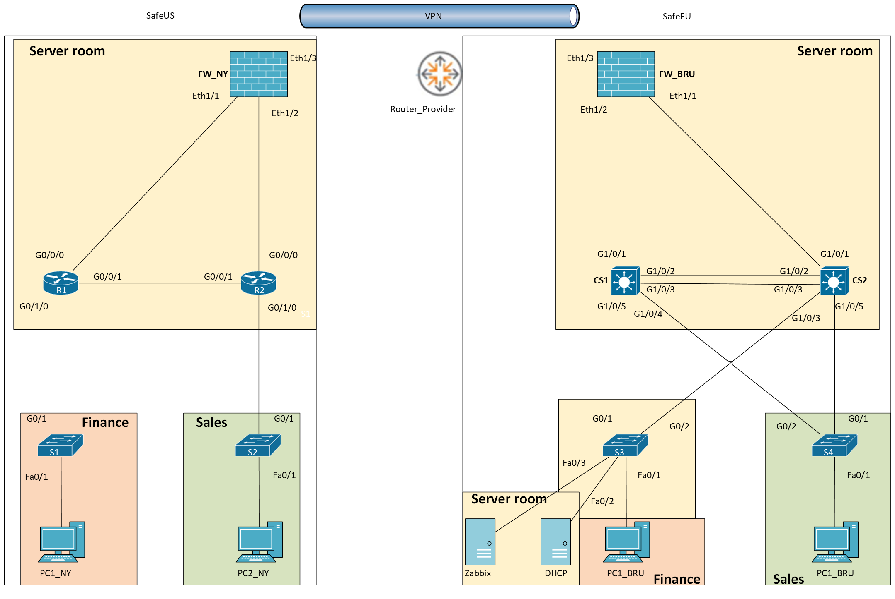
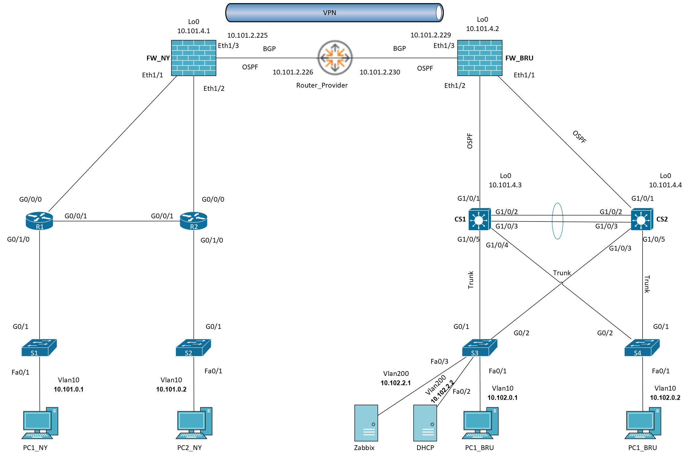

## 🌐 IP Addressing
### Network IP Plan: POD-1

#### New York (10.101.0.0/16)
| Subnet | Mask | IP Range | Hosts | Virtuele GW | Default GW | Network | Broadcast | VLAN | Name |
|:---|:---|:---|:---|:---|:---|:---|:---|:---|:---|
| Data | 255.255.255.0 | 10.101.0.1 - .254 | 254 | 10.101.0.254 | 10.101.0.1 | 10.101.0.0 | 10.101.0.255 | Vlan10 | Data |
| Wireless | 255.255.255.0 | 10.101.1.1 - .254 | 254 | 10.101.1.254 | 10.101.1.1 | 10.101.1.0 | 10.101.1.255 | Vlan20 | Wireless |
| Server | 255.255.255.192 | 10.101.2.1 - .62 | 62 | 10.101.2.62 | 10.101.2.1 | 10.101.2.0 | 10.101.2.63 | Vlan200 | Server |
| Management | 255.255.255.192 | 10.101.2.65 - .126 | 62 | 10.101.2.126 | 10.101.2.65 | 10.101.2.64 | 10.101.2.127 | Vlan100 | Management |
| Free vlan | 255.255.255.192 | 10.101.2.129 - .190 | 62 | - | - | 10.101.2.128 | 10.101.2.191 | - | - |
| Free vlan | 255.255.255.224 | 10.101.2.193 - .222 | 30 | - | - | 10.101.2.192 | 10.101.2.223 | - | - |
| P2P 1 | 255.255.255.252 | 10.101.2.225 - .226 | 2 | - | - | 10.101.2.224 | 10.101.2.227 | - | - |
| P2P 2 | 255.255.255.252 | 10.101.2.229 - .230 | 2 | - | - | 10.101.2.228 | 10.101.2.231 | - | - |
| P2P 3 | 255.255.255.252 | 10.101.2.233 - .234 | 2 | - | - | 10.101.2.232 | 10.101.2.235 | - | - |
| P2P 4 | 255.255.255.252 | 10.101.2.237 - .238 | 2 | - | - | 10.101.2.236 | 10.101.2.239 | - | - |
| P2P 5 | 255.255.255.252 | 10.101.2.241 - .242 | 2 | - | - | 10.101.2.240 | 10.101.2.243 | - | - |
| P2P 6 | 255.255.255.252 | 10.101.2.245 - .246 | 2 | - | - | 10.101.2.244 | 10.101.2.247 | - | - |

**Loopbacks (NY):** `10.101.4.1` through `10.101.4.8`

---

#### Brussels (10.102.0.0/16)
| Subnet | Mask | IP Range | Hosts | Virtuele GW | Default GW | Network | Broadcast | VLAN | Name |
|:---|:---|:---|:---|:---|:---|:---|:---|:---|:---|
| Data | 255.255.255.0 | 10.102.0.1 - .254 | 254 | 10.102.0.254 | 10.102.0.1 | 10.102.0.0 | 10.102.0.255 | Vlan10 | Data |
| Wireless | 255.255.255.0 | 10.102.1.1 - .254 | 254 | 10.102.1.254 | 10.102.1.1 | 10.102.1.0 | 10.102.1.255 | Vlan20 | Wireless |
| Server | 255.255.255.192 | 10.102.2.1 - .62 | 62 | 10.102.2.62 | 10.102.2.1 | 10.102.2.0 | 10.102.2.63 | Vlan200 | Server |
| Management | 255.255.255.192 | 10.102.2.65 - .126 | 62 | 10.102.2.126 | 10.102.2.65 | 10.102.2.64 | 10.102.2.127 | Vlan100 | Management |
| Free vlan | 255.255.255.192 | 10.102.2.129 - .190 | 62 | - | - | 10.102.2.128 | 10.102.2.191 | - | - |
| Free vlan | 255.255.255.224 | 10.102.2.193 - .222 | 30 | - | - | 10.102.2.192 | 10.102.2.223 | - | - |
| P2P 1 | 255.255.255.252 | 10.102.2.225 - .226 | 2 | - | - | 10.102.2.224 | 10.102.2.227 | - | - |
| P2P 2 | 255.255.255.252 | 10.102.2.229 - .230 | 2 | - | - | 10.102.2.228 | 10.102.2.231 | - | - |
| P2P 3 | 255.255.255.252 | 10.102.2.233 - .234 | 2 | - | - | 10.102.2.232 | 10.102.2.235 | - | - |
| P2P 4 | 255.255.255.252 | 10.102.2.237 - .238 | 2 | - | - | 10.102.2.236 | 10.102.2.239 | - | - |
| P2P 5 | 255.255.255.252 | 10.102.2.241 - .242 | 2 | - | - | 10.102.2.240 | 10.102.2.243 | - | - |
| P2P 6 | 255.255.255.252 | 10.102.2.245 - .246 | 2 | - | - | 10.102.2.244 | 10.102.2.247 | - | - |

**Loopbacks (Brussels):** `10.102.4.1` through `10.102.4.8`

## 🔌 Physical Topology
<!--  -->

## 🔗 Logical Topology
<!--  -->

