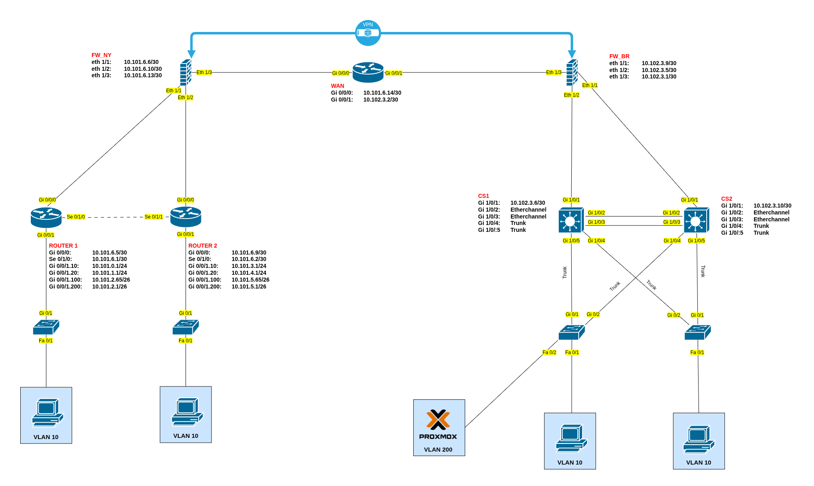

# CSN Project 2026

> Connecting & Securing Networks project met twee sites: **New York** en **Brussel**, verbonden via een gesimuleerde WAN-provider en beveiligd met firewalls/VPN.



---

## Overzicht

Dit project bouwt een enterprise-labnetwerk met twee locaties. Beide sites gebruiken VLAN-segmentatie, dynamische routing en firewalling. De WAN-router stelt de provider voor en wisselt routes uit met de firewalls via BGP. Binnen de sites wordt OSPF gebruikt.

**Belangrijkste technologieën:**

- VLANs en 802.1Q trunks
- Inter-VLAN routing
- OSPF binnen de sites
- BGP tussen firewalls en WAN-provider
- HSRP, EtherChannel en Rapid PVST+ in Brussel
- NAT, firewall policies en site-to-site VPN
- SSH-management op Cisco-apparaten

---

## Repositorystructuur

```text
.
├── Config_WAN/          # WAN/provider-router
├── Configs_BRU/         # Brussel-site
├── Configs_NY/          # New York-site
├── Configs_PT/          # Packet Tracer-bestanden
├── Documentation/       # Topologie, documentatie en testen
├── Changelog.txt
└── README.md
```

---

## VLANs

| VLAN | Naam | Doel |
|---:|---|---|
| 10 | USERS | Gebruikers |
| 20 | WIRELESS | Wireless clients |
| 100 | MANAGEMENT | Beheer van netwerkapparatuur |
| 200 | SERVERS | Servers en services |

---

## IP-plan

### New York

New York gebruikt router-on-a-stick op `R1_NY` en `R2_NY`. Beide routers hebben subinterfaces voor de VLANs en gebruiken OSPF richting de firewall.

| Segment | Subnet | Gateway |
|---|---|---|
| R1_NY VLAN 10 | `10.101.0.0/24` | `10.101.0.1` |
| R1_NY VLAN 20 | `10.101.1.0/24` | `10.101.1.1` |
| R1_NY VLAN 100 | `10.101.2.64/26` | `10.101.2.65` |
| R1_NY VLAN 200 | `10.101.2.0/26` | `10.101.2.1` |
| R2_NY VLAN 10 | `10.101.3.0/24` | `10.101.3.1` |
| R2_NY VLAN 20 | `10.101.4.0/24` | `10.101.4.1` |
| R2_NY VLAN 100 | `10.101.5.64/26` | `10.101.5.65` |
| R2_NY VLAN 200 | `10.101.5.0/26` | `10.101.5.1` |

**Management-IP's switches:**

| Device | IP-adres |
|---|---|
| SW1_NY | `10.101.2.66/26` |
| SW2_NY | `10.101.5.66/26` |

**Transitlinks:**

| Link | Subnet | IP's |
|---|---|---|
| R1_NY ↔ R2_NY | `10.101.6.0/30` | R1 `10.101.6.1`, R2 `10.101.6.2` |
| R1_NY ↔ FW_NY | `10.101.6.4/30` | R1 `10.101.6.5`, FW `10.101.6.6` |
| R2_NY ↔ FW_NY | `10.101.6.8/30` | R2 `10.101.6.9`, FW `10.101.6.10` |
| FW_NY ↔ R_WAN | `10.101.6.12/30` | FW `10.101.6.13`, WAN `10.101.6.14` |

---

### Brussel

Brussel gebruikt twee Layer 3 core switches met HSRP als redundante default gateway. De access switches hangen redundant aan beide core switches.

| VLAN | Subnet | CS1-BRU | CS2-BRU | HSRP gateway |
|---:|---|---|---|---|
| 10 | `10.102.0.0/24` | `10.102.0.1` | `10.102.0.2` | `10.102.0.254` |
| 20 | `10.102.1.0/24` | `10.102.1.1` | `10.102.1.2` | `10.102.1.254` |
| 100 | `10.102.2.64/26` | `10.102.2.65` | `10.102.2.66` | `10.102.2.126` |
| 200 | `10.102.2.0/26` | `10.102.2.1` | `10.102.2.2` | `10.102.2.62` |

**Management-IP's access switches:**

| Device | IP-adres |
|---|---|
| AS1-BRU | `10.102.2.67/26` |
| AS2-BRU | `10.102.2.68/26` |

**Transitlinks:**

| Link | Subnet | IP's |
|---|---|---|
| CS1-BRU ↔ FW_BRU | `10.102.3.4/30` | CS1 `10.102.3.6`, FW `10.102.3.5` |
| CS2-BRU ↔ FW_BRU | `10.102.3.8/30` | CS2 `10.102.3.10`, FW `10.102.3.9` |
| FW_BRU ↔ R_WAN | `10.102.3.0/30` | FW `10.102.3.1`, WAN `10.102.3.2` |

---

## Routing

| Protocol | Waar | Doel |
|---|---|---|
| OSPF area 0 | Binnen New York en Brussel | Interne routes uitwisselen |
| BGP | Tussen firewalls en WAN-router | Routes tussen sites/provider uitwisselen |
| Static default routes | Routers/core richting firewall | Niet-lokaal verkeer naar de firewall sturen |

### BGP AS-nummers

| Apparaat | AS |
|---|---:|
| FW_NY | 65100 |
| R_WAN | 65200 |
| FW_BRU | 65300 |

---

## Configuratiebestanden

| Map | Inhoud |
|---|---|
| `Configs_NY/` | Routers, switches en firewallconfiguratie van New York |
| `Configs_BRU/` | Core switches, access switches en firewallconfiguratie van Brussel |
| `Config_WAN/` | WAN/provider-router |
| `Configs_PT/` | Packet Tracer-bestanden |
| `Documentation/` | Topologie, planning, rapporten en acceptatietesten |

---

## Verificatiecommando's

### Switching

```bash
show vlan brief
show interfaces trunk
show spanning-tree
show etherchannel summary
show standby brief
```

### Routing

```bash
show ip interface brief
show ip route
show ip ospf neighbor
show ip route ospf
show ip bgp summary
show ip route bgp
```

### Firewall / VPN

```bash
show access-list
show nat
show crypto isakmp sa
show crypto ipsec sa
```

Op Palo Alto:

```bash
show routing route
show routing protocol bgp summary
show vpn ike-sa
show vpn ipsec-sa
show session all
```

Een werkende IPsec-tunnel toont een actieve IKE SA. Bij Cisco ASA hoort de IKEv1-status bijvoorbeeld `QM_IDLE` te zijn.

---

## Testen

De acceptatietesten staan in `Documentation/user-acceptance.xlsx`. Hierin worden onder andere connectiviteit, VLANs, OSPF, BGP, HSRP, failover en VPN gecontroleerd.

---

## Aandachtspunten

- De configuraties zijn bedoeld voor een school-/labomgeving.
- Sommige bestanden bevatten labwachtwoorden zoals `cisco` en `class`.
- Tijdelijke allow-regels op firewalls moeten in een productieomgeving verder verstrengd worden.

---

## Team

- Roy Cannaerts
- Beau Berghmans
- Christof Clauwaert
- Kenchy Schroyen

---

**CSN Project 2026 — Thomas More Geel**
