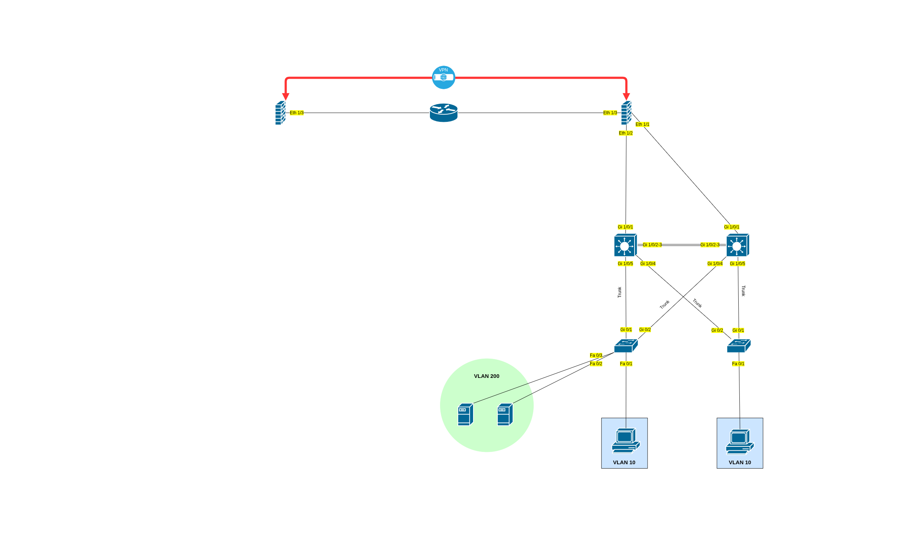

# 🖧 Connecting & Securing Networks (CSN) Project 2026

> Designing and implementing a redundant, self-healing enterprise network across two sites — built in Cisco Packet Tracer and deployed on real hardware.

---

## 👥 Contributors
* Roy Cannaerts
* Beau Berghmans
* Christof Clauwaert
* Kenchy Schroyen

---

*CSN Project 2026 — Thomas More Geel*
